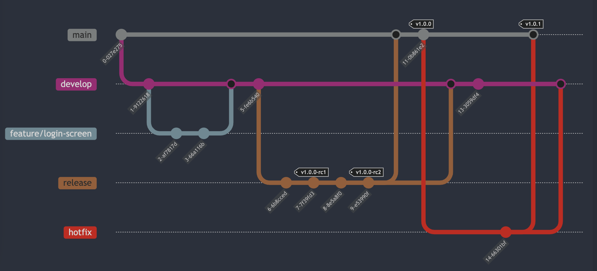

#   Branch Structure

In this project, I use the **Gitflow** model, which consists of different branches for various stages of development:

- **Main (or Master)**: This branch **always contains the most stable, production-ready version**.
- **Develop**: This branch contains **the latest developments and merges of all feature branches**. After testing is completed, changes from the develop branch are **merged into the main branch**.
- **Feature branches**: When developing a new feature, I create a **new branch from the develop branch** (e.g., `feature/login-screen`). Once the feature is completed, it is **merged back into the develop branch**.
- **Hotfix branches**: If a **critical issue** is detected in the main branch, I create a **hotfix branch directly from the main branch**. Once the issue is resolved, the **hotfix branch is merged into both the main and develop branches**.
- **Release branches**: Before releasing a major version, I create a **release branch from the develop branch** to finalize any last-minute changes or bug fixes. Once the release is stable, the **release branch is merged into the main branch**. During the release process, I use **RC (Release Candidate) tags** to track the release progress.

  For example:
    - Using the command `git tag v1.0.0-rc1`, I create the first release candidate from the **develop branch** and test it.
    - If any issues are found, I apply fixes and tag a **new release candidate**.
    - After all bugs are fixed and testing passes, I tag the **final version with `git tag v1.0.0`** and proceed with the production release.
    - The **final version tag is always created from the main branch**, as it represents the most stable and production-ready code.

Here's the Git Flow diagram :

1. We start by making the initial commit on the **main** branch.
2. The **develop** branch is created, and all new development takes place here.
3. A **feature** branch (`feature/login-screen`) is created from the **develop** branch. Development on this specific feature takes place on this branch.
4. The feature is completed and merged back into the **develop** branch after finishing the feature.
5. A **release** branch is created from the **develop** branch to finalize the version for production.
6. A **release candidate** (`v1.0.0-rc1`) is tagged during testing on the **release** branch.
7. Further changes or fixes result in another **release candidate** (`v1.0.0-rc2`).
8. After testing and finalizing the release, the **release branch** is merged into the **main** branch, and the final version **v1.0.0** is tagged.
9. The **release branch** is also merged back into the **develop** branch to ensure that both branches are up to date with the latest changes.
10. New developments continue on the **develop** branch after the release.
11. A **hotfix** branch is created from the **main** branch to address a critical issue in production.
12. Once the issue is fixed, the **hotfix** branch is merged into both the **main** and **develop** branches.
13. A new version **v1.0.1** is tagged on the **main** branch to reflect the applied hotfix.

---

### Long-lived branches

The **develop** and **main** branches are **long-lived branches**. **Feature** and **release branches** are **short-lived** and used for temporary work within the project.

---

By using the **Gitflow** model, I ensure an organized and controlled development process between the different branches.
